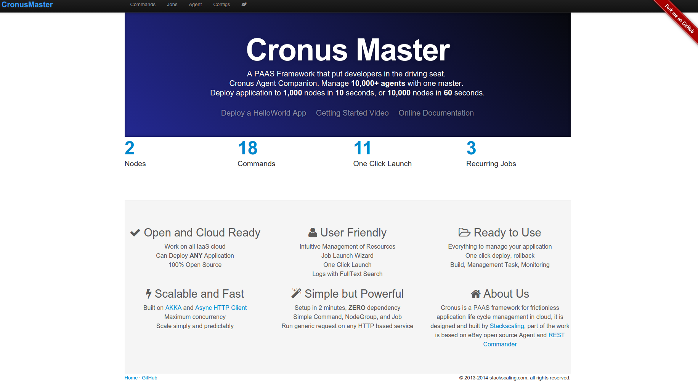

Introduction
=========================

Cronusmaster can execute any http(s) request against one or many target nodes. Think of it as a RESTful client that can run with predefined template on target node grammatically at scale. Cronusmaster is used to execute different tasks on cronus agent through its RESTful interface.

* Command: Defines a HTTP(S) request template
* Nodegroup: Defines a list of nodes that will be targets of a command
* Job: A command that runs on a nodegroup
* Scheduled Job: A command run on a nodegroup with a recurring schedule
* Log: Execution result and log of a job

**To put cronusmaster to work**

#. Define HTTP(S) command template
#. Define nodegroup with target node IPs or hostnames
#. Execute materialized commmand on a nodegroup as a job
#. Check result of the job in the log
#. Optinoally create an oneclick launch from an already executed job
#. Optionally create a recurring job from an already executed job or oneclick launch

