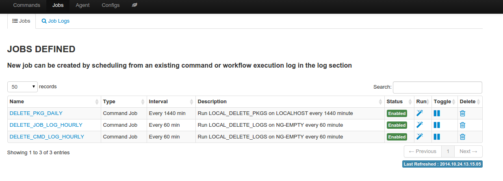

Recurring Job
===============

An existing one time command job or oneclick launch can be made to run repeatly as a recurring job.

**Create Recurring Job**

#. Recurring job can be created in two ways

   * Create from an existing command job from command job log
   * Create from an existing oneclick launch

#. Go through the recurring job wizard to define a name uniquely identified the job, and recurring frequency in the interval of 5 minutes
#. Once saved, job running state can be toggled on and off from the Job page
#. Job log of previously launched job can be found in job log 

