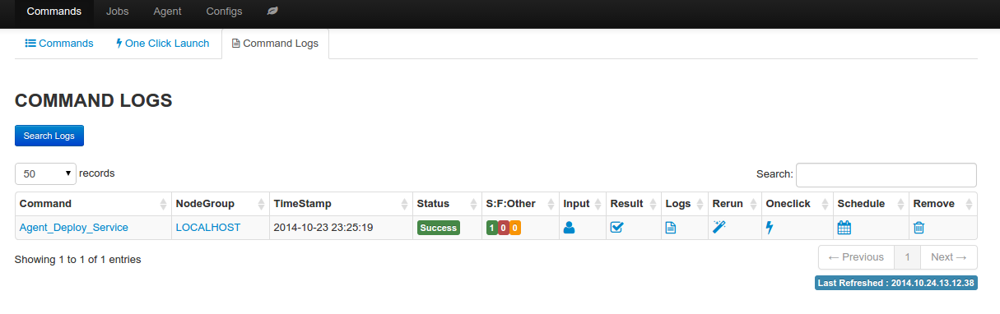
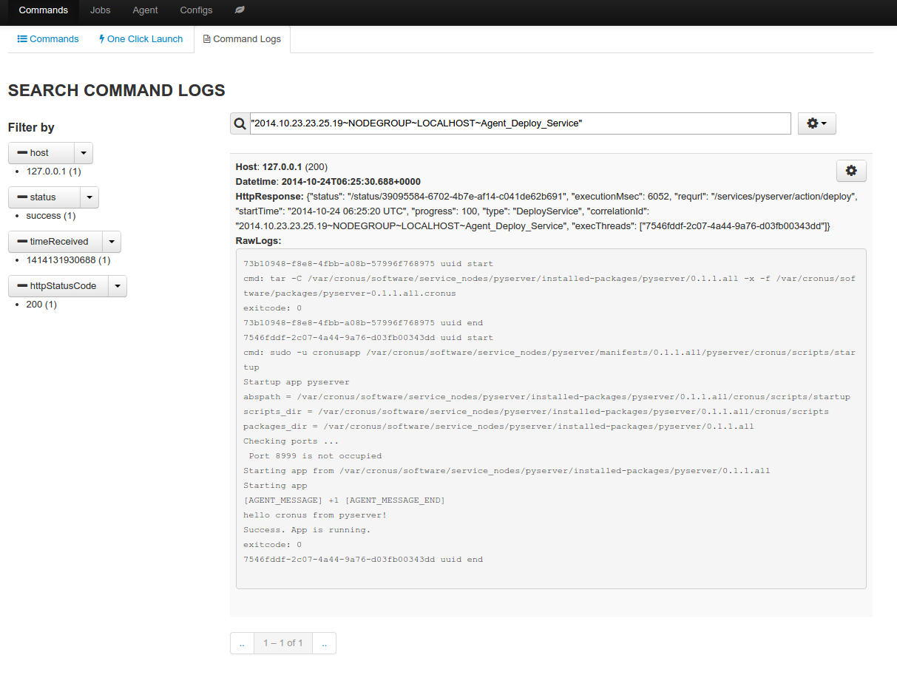

Command Log
==============

Log provide important information about result of command job, and provide chance to create new oneclick launch and recurring job. 

Information available from the log

  * status: status of the job (running|success|failure)
  * S:F:Other: number of nodes for each status value
  * input: customize user data
  * result: summary of the result in json format, the raw response form the target node are truncated to 200 characters
  * logs: full text search of  the job result, as well as raw logs from the target node
  * rerun: run the same command job again
  * oneclick: create a new oneclick launch from the command job
  * schedule: create a recurring job from the command job
  * remove: delete the particular log, as well as related full text search entry

command logs

full text search

