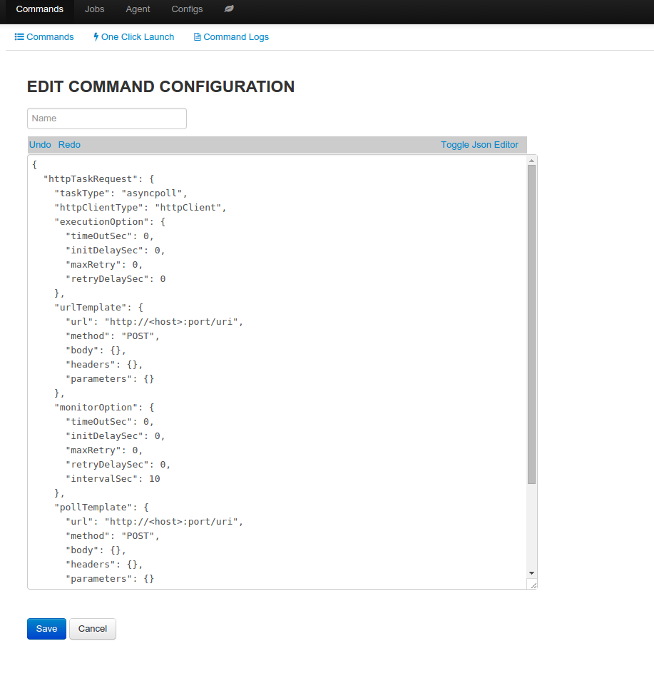
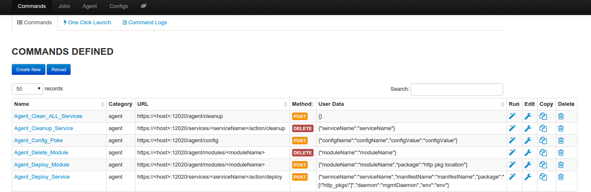
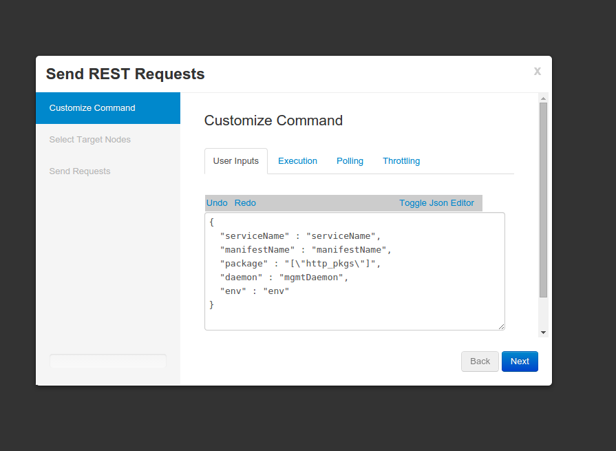
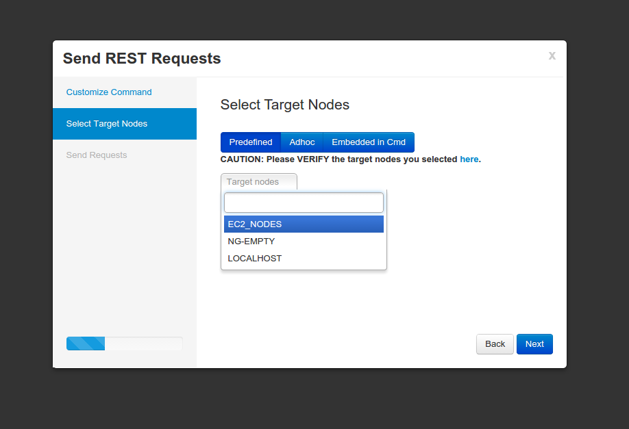

Command
===================

**Create command**

#. Command can be created in two ways

   * Create from scratch
   * Clone from an existing command 

#. Define command type

   * async: request with reponse as the result
   * asyncpoll: request followed by polling to get result

#. Fill in the command template with http request values, similar to defining http request in RESTful client like POSTMAN

#. Define template parameter; template parameter can be used in all http reuqest values, template parameter is identified by "<>", minimally if the command can be executed against different hosts, "<host>" needs to be part of the url value. Template parameters will be replace with real values at execution time, or if values are not provided, the parameters will be skipped.

#. Define user data, it will be used to drive command launch wizard

edit command 

**Modify command**

Except the name, which is immutable, data of the command can be modified

**Delete command**

Delete command from persistent store

command summary page

**Run command** 

Run command will launch command wizard

* wizard screen 1: customize command with execution options, user data
* wizard screen 2: select nodegroup against which command will be run
* wizard screen 3: confirm and launch command job, job progress and result can be found in command job log. 

wizard screen 1

wizard screen 2

wizard screen 3

.. image:: ../images/command_wizard_3.png
