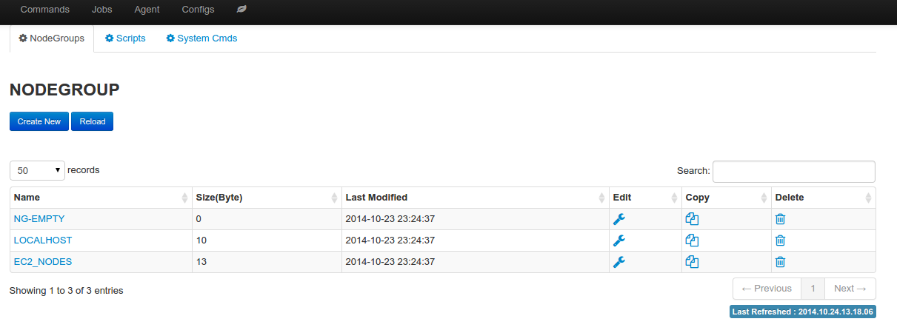

Nodegroup
================

Nodegroup defines a group of nodes with similar characteristics, and similar purpose. For example, a group of nodes that install the same operating system and cronus agent, in the same network, and are running the same application.

**Create nodegroup**

Nodegroup is uniquely identified by its name, values are line separated hostnames or IPs.

**Use nodegroup**

* Can be referenced in command wizard when run command job
* Can be referenced in oneclick launch
* Can be referenced in recurring job

.. image:: ../images/nodegroup_edit.png
