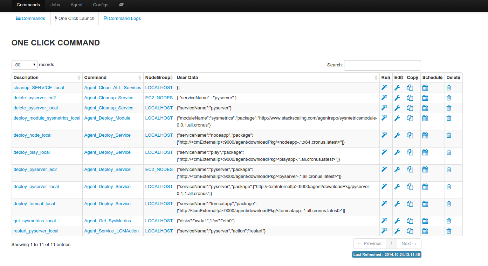

OneClick Launch
===================

Oneclick launch captures all the input necessary to launch a command job, this allows a job to be launched with "one click" (or one API call).

**Why it is useful**

* Deploy or rollback applications with one click or one API call
* Save a job for repeated execution later
* Enhance automation with adaptive smart template parameters, for example can deploy latest application package to target nodes as the application package gets uploaded

**Sample oneclick launch**

.. code-block:: javascript

   {
    "name": "deploy_pyserver_local",                      // unique name of the oneclick command
    "userData": {                                         // custom user data
      "exe_retry": "3",                                   // execution options
      "mon_retry": "3",
      "thrStrategy": "UNLIMITED",
      "mon_int": "10"
      // user data
      "var_values": "{\"serviceName\":\"pyserver\",\"package\":[\"http://<cmInternalIp>:9000/agent/downloadPkg/<pyserver-.*.all.cronus.latest>\"]}",
    },
    "commandKey": "Agent_Deploy_Service",                 // command name
    "nodeGroupKey": "LOCALHOST"                           // nodegroup name
   }

**Create oneclick launch**

Oneclick launch can be created in two ways

#. From command log tab, save an already executed command job as oneclick launch
#. From oneclick launch tab, create by cloning an existing oneclick launch

**Smart template parameters**

The following smart template parameters can be used in oneclick launch to allow greater degree of reusability

* <cmExternalIp>: reference public IP of the cronus master, value defined in cronusmaster config file
* <cmInternalIp>: reference private IP of the cronus master, value defined in cronusmaster config file
* <service-.*.platform.cronus.latest>: reference latest uploaded package for a service, for example <pyserver-.*.all.cronus.latest> is the latest version of the pyserver package, <pyserver-1.*.all.cronus.latest> is the latest version of 1.x.y of the pyserver package

With smart template parameters, one can create an oneclick launch to deploy latest application package to a group of nodes, without having to change anything in the oneclick launch.

**Run oneclick**

Run from "oneclick launch" tab with a single click, or one API call, redirect to command job log page upon successful launch.

